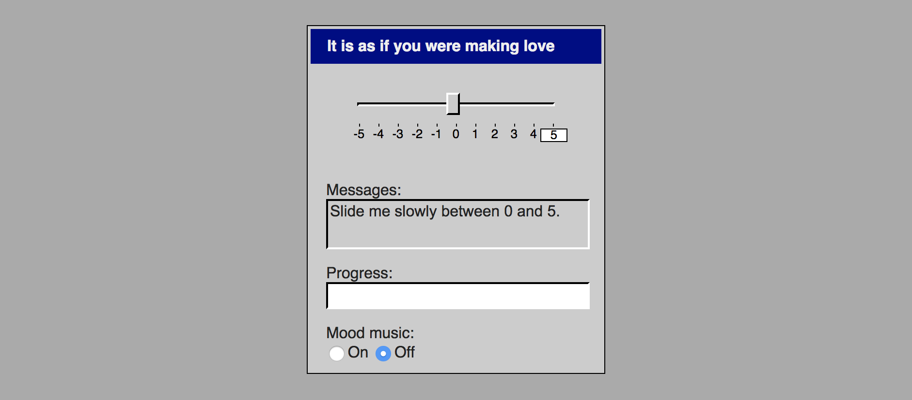

# *It is as if you were making love*

# [Play Online](https://www.pippinbarr.com/itisasifyouweremakinglove/) (desktop and mobile)

## Description
_Physical intimacy is a thing of the past! Finally! But wait! Why do you feel so alone?! You want to touch someone?! Make them feel good?! But you don't really want to actually have to touch someone?! You don't really want to deal with another human?! Well you're in luck! With this new application it is as if you were making love!_

_It is as if you were making love_ is the sequel to [_It is as if you were doing work_](https://github.com/pippinbarr/itisasifyouweredoingwork). It is an application from a near future in which humans have lost the interest and will for physical sex with other humans. The application provides you with the experience of erotically pleasuring someone without the involvement of another human being, replacing that role with a user-interface.

## Press
- Corbinais, Pierre. [It is as if you were making love](http://oujevipo.fr/general/6945-it-is-as-if-you-were-making-love/). Oujevipo. 29 June 2018.
- Wilbur, Brock. [It Is As If You Were Making Love is complicated at best](https://www.rockpapershotgun.com/2018/06/30/it-is-as-if-you-were-making-love-is-complicated-at-best/#more-560929). Rock, Paper, Shotgun. 30 June 2018.
- Fraser, Calum. [It Is As If You Were Making Love – Browser Game](https://www.freegameplanet.com/it-is-as-if-you-were-making-love-browser-game/). Free Game Planet. 1 July 2018.

Read the [Press Kit](../press) for press information

## Documentation
* Read the [Process Documentation](../process) for process journal entries, to dos, and manifestos
* Read the [Commit History](https://github.com/pippinbarr/itisasifyouweremakinglove/commits/master) for detailed, moment-to-moment insights into the development process
* Look at the [Code Repository](https://github.com/pippinbarr/itisasifyouweremakinglove) for source code etc.

## License
_It is as if you were making love_ is an open source game licensed under a [Creative Commons Attribution-NonCommercial 3.0 Unported License](http://creativecommons.org/licenses/by-nc/3.0/). You can obtain the source code from its [code repository](https://github.com/pippinbarr/itisasifyouweremakinglove) on GitHub.
