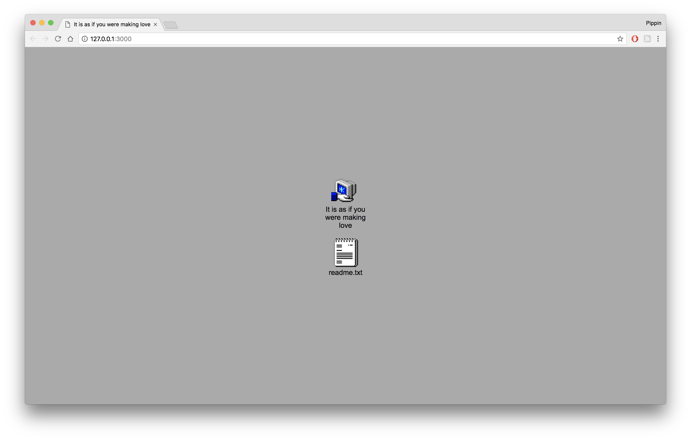
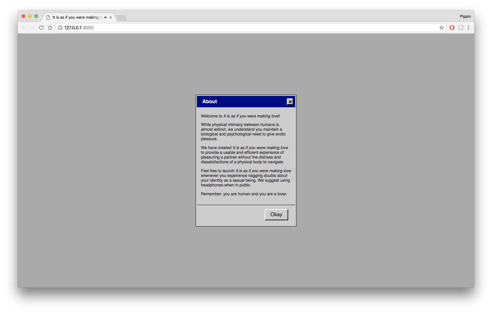
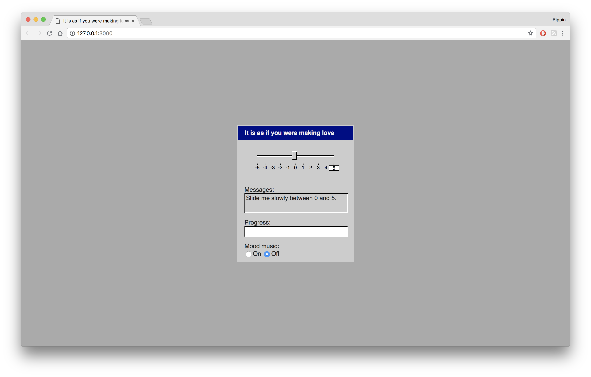
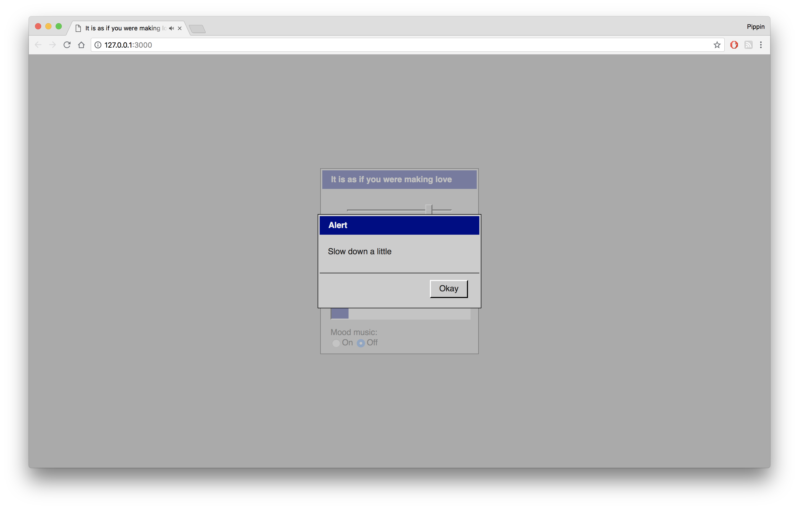
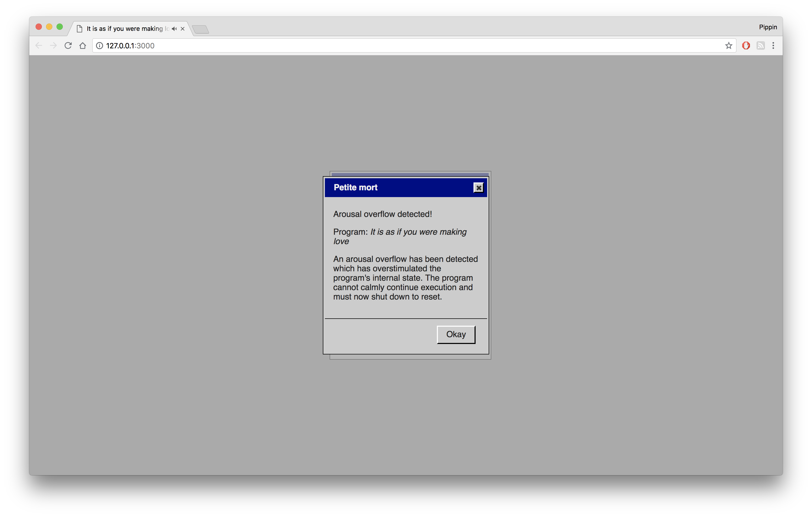

# _It is as if you were making love_ Press Kit

#### [Play _It is as if you were making love_](https://pippinbarr.github.io/itisasifyouweremakinglove/)

## The basics

* Developer: [Pippin Barr](http://www.pippinbarr.com/)
* Release: Thursday, 28th June 2018
* Platform: Browser (mobile- and tablet-friendly)
* Code repository: https://www.github.com/pippinbarr/itisasifyouweremakinglove/
* Price: $0.00

## Who is this Pippin Barr guy?

Pippin is an experimental game developer who has made games about everything from [Eurovision](http://www.pippinbarr.com/2012/03/27/epic-sax-game/) to [performance art](http://www.pippinbarr.com/2011/09/14/the-artist-is-present/) to [dystopian post-work futures](http://www.pippinbarr.com/games/2017/07/03/it-is-as-if-you-were-doing-work.html). He's an Assistant Professor in the [Department of Design and Computation Arts](http://www.concordia.ca/finearts/design.html) at [Concordia University](http://www.concordia.ca/) in Montréal. He is also the associate director of the [Technoculture, Art, and Games (TAG)](http://tag.hexagram.ca/) Research Centre, which is part of the [Milieux Institute for Arts, Culture, and Technology](http://milieux.concordia.ca/).

## Description

_Physical intimacy is a thing of the past! Finally! But wait! Why do you feel so alone?! You want to touch someone?! Make them feel good?! But you don't really want to actually have to touch someone?! You don't really want to deal with another human?! Well you're in luck! With this new application it is as if you were making love!_

---

_It is as if you were making love_ is a game posing as an application from a near future in which humans have lost the interest and will for physical sex with other humans. Whether this is through distaste or for other reasons is not made clear. The application promises to provide humans with the experience of erotically pleasuring someone without the involvement of another human being. The experience is created as you interact with a set of standard user-interface elements styled in the tradition of a classic operating system along the lines of Windows 3.1 or 95. The major input element here is a slider, which is used to sexually please the interface, while other elements such as a text-field, a progress bar, and dialog boxes provide feedback on your success.

You will know when you have 'won'.

## History

_It is as if you were making love_ began life as a game idea in my notebook that simply read 'UI COMPUTER SEX GAME: a button yes yes yes yes yes YES!'. I was interested in how I could (or could not) convey an erotic experience through a decidedly unerotic set of interface elements, initially a button, but later a slider (with other ideas along the way). Much of the inspiration for this also comes from the webgame [_Sepe's Cumshot_](https://www.comdotgame.com/play/sepes-cumshot) (extremely not safe for work), which I found very compelling in its ability to make me feel awkward but also the sensation of giving pleasure to another entity. Naturally, a lot of the work for this in _Sepe's Cumshot_ comes from its representation of an actual human body, so I was curious about the idea of removing the visual reference but keeping the experience.

Like any project, _It is as if you were making love_ changed over time, but the fundamental question stuck. Eventually I decided it was the sequel to [_It is as if you were doing work_](https://github.com/pippinbarr/itisasifyouweredoingwork), which included the realisation that I could use the same early-Windows style of graphical user-interface (though that came with its own weird problems). As such, _It is as if you were making love_ came to be positioned, like _It is as if you were doing work_, as a form of [Speculative Play](http://www.speculativeplay.com/). That is, it is a playful, interactive experience that seeks to comment on the present by representing itself as an artifact (application) from a possible future - in this case a specific meditation on sex in the context of technology and automation.

The documentation surrounding _It is as if you were making love_ in the code repository is part of a process documentation approach developed with my colleagues [Rilla Khaled](https://rillakhaled.github.io/) and [Jonathan Lessard](https://jonathanlessard.net/) called the [MDMA](http://www.gamesasresearch.com/mdma) (for me it stands for _Method for Design Materialisation and Analysis_) and it forms a fundamental part of our [Games as Research](http://www.gamesasresearch.com/) project.

If you want to, you can read a blow-by-blow history of the game's development by reading its [process documentation wiki](https://github.com/pippinbarr/itisasifyouweremakinglove/wiki) and by going through its [commit history](https://github.com/pippinbarr/itisasifyouweremakinglove/commits/master).

## Technology

_It is as if you were making love_ was written in JavaScript and HTML using [jQuery](http://jquery.com/) and [jQueryUI](http://jqueryui.com/) for its basic functionality and user-interface elements, [jQuery UI Touch Punch](http://touchpunch.furf.com/) to help it work on mobile devices, and [Howler.js](https://howlerjs.com/) for some audio handling.

_It is as if you were making love_ is an open source game licensed under a [Creative Commons Attribution-NonCommercial 3.0 Unported License](http://creativecommons.org/licenses/by-nc/3.0/). You can obtain the source code from its [code repository](https://github.com/pippinbarr/itisasifyouweremakinglove) on GitHub.

## Features

- Horizontal slider!
- Progress bar!
- Text area!
- Dialog boxes!
- Desktop icons!
- Sex!

### Trailer

## Images

     

## Additional Links

- [Blog posts about _It is as if you were making love_](https://www.pippinbarr.com/search.html?q=%22It%20is%20as%20if%20you%20were%20making%20love%22)
- [Process documentation of _It is as if you were making love_](https://github.com/pippinbarr/itisasifyouweremakinglove/wiki)
- [Commit history of _It is as if you were making love_](https://github.com/pippinbarr/itisasifyouweremakinglove/commits/master)
- [It is as if you were doing work](http://www.pippinbarr.com/games/2017/07/03/it-is-as-if-you-were-doing-work.html) (the previous game in the series)

## Credits

* Pippin Barr: everything...?

## Testing

* Jim Barr
* Mary Barr
* Jess Rowan Marcotte
* Rilla Khaled

## Contact

* Email: [pippin.barr+press@gmail.com](mailto:pippin.barr+press@gmail.com)
* Website: [www.pippinbarr.com](http://www.pippinbarr.com/)
* Twitter: [@pippinbarr](https://www.twitter.com/pippinbarr)
* Instagram: [@pippinbarr](https://www.instagram.com/pippinbarr)
* Facebook: [Pippin Barr](http://www.facebook.com/pippin.barr)
