# 2017? -- In the beginning

Here is the original game idea from my Things Game Ideas list.

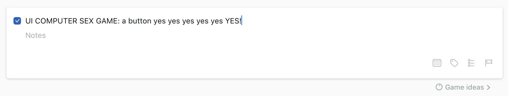

---

# 2018-03-24 -- In which a bunch of early design notes from the iPad

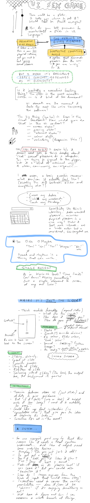

---

# 2018-03-30 -- In which some more design notes from the iPad

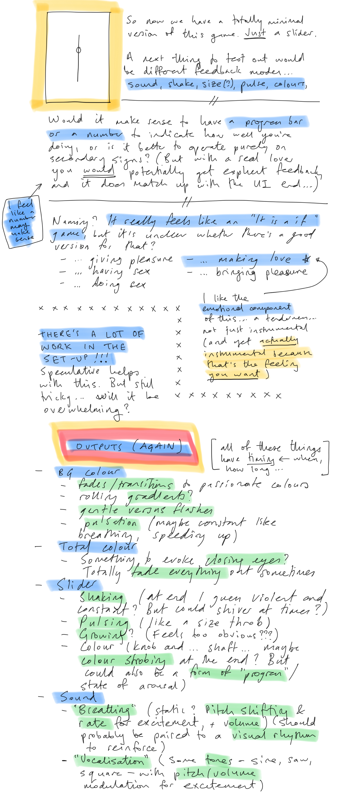

---

# 2018-04-02 17:53 -- In which I set down the lay of the land and think about title, references, and what's needed

So I have officially started this project gently over the last couple of days, gathering my strength after the kind-of-disappointment around _Tanks!?_, a game I think was very interesting but perhaps only to me.

At present I have a generic-looking, vertically-oriented slider and the ability to toggle a few differen audio-visual effects as I try to get a sense of what kinds of feedback might be possible within the technology.

I'm using jQuery and jQueryUI again to create this, and a bunch of the effects currently are just CSS animations. So it's pleasingly simple in terms of technology, certainly related to _It is as if you were doing work_.

__Title__

I started out with the project being called _Slider_ to have something generic that wouldn't colour the experience, but it's fairly clear it belongs in the _It is as if..._ series and so needed that shape of title. I've settled for now on _It is as if you were making love_ as a way not just to indicate the basic function, but also to try to tinge it in a direction that's not totally instrumentalised and potentially porny. The feeling I'm looking for is a little closer to sexual tenderness? I think.

__Reference points__

I should go on the record immediately by saying that my primary reference point in terms of the feeling of this thing is _Sepe's Cumshot_, that amazing webgame of masturbating a bit and muscly man. I've always been interested in the feeling that game generates in me, both of a kind of 'wrongness' (for me, personally) but also a genuine erotic layer, which I find hilarious given how crass it mostly is. Or perhaps it isn't crass at all, but rather artfully done, given how subtle the emotional range is (for me).

Along with that it's fairly obvious moving forward that _Luxuria Superbia_ is a key reference point, both as a basic 'sex game', but especially as a sex game that's trying to be sexy/erotic without "resorting" to obvious/straightforward human imagery. It maintains a related sense of the alien, the technological, so it's important. I'd say I'm distinguishing this work from that game in trying to achieve something related through a very formal and conventional user-interface aesthetic. Also I suppose that this game is more "masculine" to _Luxuria Superbia_'s more "feminine" energy? Though I don't want to play on that too much.

There are many other sex games that are relevant data points. Robert Yang's work is an obvious thing here, notably the gay sex thing, given that I'm male and my interface is male-leaning given the format of the slider I guess. That ties to a key element of the game which was how to make standard UI elements sexy/erotic -- I'd initially thought the game would be composed of multiple UI elements, but quickly realised/decided that the slider was important because it maintains a base level connection to a kind of sex act (male masturbation) in its visual format and motion, which the other UI elements don't really have. Without that, my fear has been that the erotic element will be lost or hard to communicate.

__As for now__

My main point of concern design-wise is around how to indicate what's happening and to create an appropriate mood and context for the player. The absolutely central design goal is that this feel genuinely erotic in the way I find _Sepe's Cumshot_ does. The question becomes how to do that in this much more abstracted scenario.

Some of it can be done by explaining the speculative situation: a future in which life becomes more and more sterile to a point where we don't have much of an erotic/sensual experience thanks to detachment, and therefore might need a piece of software that safely but sensually allows us to experience the pleasure of giving pleasure. That's the elevator pitch.

But then also there are modes of feedback that are important in order to register the pleasure of giving pleasure: you need to register that pleasure is being received in order to enjoy it. I want that pleasure to somehow seem _technological_ but not so technological that it is utterly alien. And not so human that I'm just recreating _Sepe's Cumshot_ with a slider, having it ejaculate all over the screen or something.

So that is the current state of consideration. More news as the situation develops.

---

# 2018-04-09 14:15, Monday -- On CART415 discussion, input parameters, failure, Sepe's Cumshot, game flow

## Feedback from CART415

I presented the basic idea of the game to the class today including the current small set of CSS animations that can be triggered to indicate feedback, and they gave some insightful/helpful feedback:

- Modem sound as a kind of machine noise that could be thought of in this context
- Procedural audio connected to the actual motion (user and pulsing etc) in order to create something that feels like a physical connection
- Space Team as a reference point, multiple UI forms (though may lean a bit far toward comedy)
- Other UI elements (could be thought of as an acknowledgment of a diversity of bodies)
- Slider itself changing form (perhaps becoming distorted, wavy, etc.)
- Consent as something that of course needs to continue to be thought about moving forward
- Actually creating some of that discomfort about the underlying LACK of pleasure for the computer (reference to Blade Runner 2046 sex scene)
- Programming as a form of giving pleasure? (This would clearly be a completely different kind of game, but an interesting point of view)
- How to represent loss of control at a moment of climax? (0s and 1s flying around?)

## What are the input parameters?

One starting point when thinking about how this game will be played is to think about the player's activity. What can the player _do_ with the slider and how can that be detected and transformed into information that I can interpret?

- Sliding
  - _Rate and range_ - suggests that the slider can want a stroke between specific limits (0-10, 2-4, etc.) where each movement within the range should be completed in a time range (slow, medium, fast - or "slower", "faster"). That would allow a base instruction of "Move between 2 and 4" or "Stay on 8" and then additional instructions while you're doing it of speed up and down.
- Caressing?
  - Could you ask them to just brush the mouse over the slider without sliding? Over the handle? Or is that sufficiently foreign that it doesn't make sense (and also doesn't work with mobile)
  - Could caress the background/screen area instead - click and drag or touch... but how do you communicate that sort of thing?

## On failure?

It came up when talking to the class - should it be possible to do poorly such that the computer is turned _off_? Or even shuts you down? On the one hand this is a better representation of sex, on the other hand it's maybe not a good fit with the idea of it being something that is ultimately meant to satisfy a human? On the other other hand, it's also true that such possibilities and experiences are part of what makes sex sexy? It's not quite so interesting/thrilling if you know it's going to work every time? On the other, other, other hand, I don't think Sepe's Cumshot goes that?

... goes to check ...

# On Sepe's Cumshot

Given this is a core reference, how does it work?

- You wave your cursor over his penis
- He goes through "stages" and you're instructed that if it's difficult getting to the next stage you should try to go faster
- He talks to you about how good he feels, which is important
- He pulses
- His penis animates (flaccid to erect, waving around a bit, gets bigger)
- He flexes his arm, self-admiration
- Tells you to go faster
- Falls off his chair, double flex, "don't stop"
- Totally amazing pure white pixel ejaculation, zooms in on his balls, cuts to white with just your hand

That is a weird game.  Notably, though, you can't "fail" with him - he remains in his current state of arousal no matter what. Which _does_ make him seem more like a thing than a partner, and makes me wonder if most of the erotic nature of things is to do more with the 'realism' and animation rather than the system of interaction.

In which case my work will probably need to be at least a little more sophisticated? And raises the question of whether the slider should have a mood, for example, such that sometimes it's not interested (and therefore perhaps has no handle on it so you can't actually interact - no means no), and that it's possible for you to revert back to zero arousal if you just leave it along or constantly don't do what it's asking you to do?

And does that end up meaning that the ideas around consent etc. become more problematic?

# Game flow

- Game starts, it's the slider on a screen and nothing else
- An instruction pops up asking for movement in a specific range (2-4) say
- Once you're doing that, you get some acknowledgment of the right area ("Yes.") and then possible additional instructions on speed ("Slow down", "Faster"). (arousal++)
- If you do nothing or something wrong, you get told: "No, not there" or maybe even "Higher" or "lower" depending on where their movements are. (arousal--)
- As arousal level goes up, we can cue some indications of success/arousal in stages (as per Sepe), so vibration, waggling, pulsing, audible 'breathing' (rhythmic white nose with a ramp etc.?), maybe a tone as well on top of that (sine or something, frequency tuned to your movement, but also climbing in pitch), maybe musical notes on the different pips as you pass them? (might be a distraction), eventually background colour shifts
- As arousal level goes down, we can remove these cues - perhaps they can be randomly collected up rather than obvious sequences? Can also tune the amount of effects (e.g. vibration rate and distance, breathing volume, pitch, rate, ramp and punch etc.)
- At some point, if you're successful/keep following instructions, there is some kind of climactic moment (might be an opportunity to have "multiple endings" here as a funny game reference thing?) - fade to white, slider flies apart in all directions, shaking increases until the slider just vanishes, or a gradual return to calm (maybe asking you to continue gently rather than just watch a performance of orgasm?), sound crescendo (modem sound? connecting... ha ha), ... etc. These could be endings you could discover (could even explicitly list this as part of the experience - 1 of 5 endings reached to get people coming back for more - although that may not make sense in terms of the speculative aspect where you would be using it specifically as a tool...)

# Interpreting input

If the user is moving the mouse up and down we can check at each moment whether they're in acceptable range of the top or bottom of the range desired (or possible if the idea is to remain still then just in range of that) - should be some basic error range.

So basically you can hit a desired point on the range, then start a timer, then check the time taken to reach the other point (becomes the target), and compare that against some desired rate (with room for error). So you basically need to know: top, bottom, time in order to be able to judge successful sliding. If top and bottom are the same and time in 0 then that can reflect leaving the slider in position. Could also have a "don't touch" mode where you can make sure the slider isn't active at all (not even clicked down on).

With those basic element you can then ask for different ranges and rates in order to determine the success of the player. Maybe also need some kind of amount of time for them to strike the right rhythm before you declare something a failure (i.e. you don't check up on them for some set amount of time after introducing the new parameters).

Doesn't actually sound like it needs to be especially complex? Ha ha, famous last words.

---

# 2018-04-12 11:52, Thursday -- On speech, expressive interactions, and what's next

## Speech, Speech

In the bath last night I was thinking about other ways of engaging in an erotic way with the UI and recalled that I'm constantly talking to my DART450 class about the power of sound and particularly the power of speech. Saying words feels, I think, like a way of taking ownership of them and engaging in their context more fully that, for instance, moving a mouse, clicking a button, etc.

So, it occurred to me to include voice input in the game as a kind of 'dirty talk' between the user and the game, to pull them into it more. As with the rest of the design I wouldn't this to be directly about sex in any way, so then there's a question of what you would say in this context, and I think it would be things like

- "Confirm"
- "Activate"
- "Acknowledge"
- "Yes"
- "Enter"
- "Complete"
- "Finish"
- "Save"
- "Zoom"
- "Search"
- "Find"
- "Select"
- "Show"
- "Paste"
- "Start"
- "New"
- "Add"
- "Success"
- "Continue"
- "OK"

And perhaps more. That is, kind of positive, active words (verbs?) that reflect successful interactions with a computer.

The next question would be how to ask the player to say these words as part of the interaction. One option is that the system literally just asks them to "Say 'Start' to me" for example. Another option is that the computer asks them sometime to "Say something" and the list of accepted words is provide in some interface element on the screen such that you can learn the kinds of things it likes to hear?

I suspect the former is going to be clearer and simpler and has a much more direct connection in terms of 'getting it right'. The latter is kind of nice because it's more creative/expressive to choose the words you want to say. Maybe you can combine by having it giving you options? "Say 'Start', 'Success', or 'Save' to me". Then you still choose which has an erotic quality - agency.

## Expressive interactions

Much of the game right now is based around the computer telling you precisely what to do (and how to do it), and I wonder whether there's a missed opportunity there. Sepe's Cumshot would have been more interesting if sometimes you went slow and that was more pleasurable for him than fast, for instance. This game can ask you to go slower or faster, but there's a difference between that and _choosing_ to go slower because part of the erotic nature of things is the lack of control your partner might have, or rather the idea of giving up control and experiencing a thrill _because_ of that. Maybe there can be a general "move the thing" implied, some requests made, but also freedom to just keep moving, to stop sometimes, to go slower or faster. This would be kind of nice, and it's still okay if the thing more or less inexorably moves toward a climax except, I guess, in the total absence of interaction.

# What's next?

- It feels like a super vital thing to get going is better sound. Sound can even be the major form of output really, with a little bit of extra trembling etc.
- It would make sense to actually create a basic arousal idea with desired ranges to just experience how that feels, then add in the idea of a rate as well.
- Test the annyang feeling.

Bam.

---

# 2018-04-23 14:21, Monday -- Where are we? / Stick Shift

## Where are we?

It's been almost two weeks since I found the time to work on this project thanks to: life. On the other hand I did have a chance to run it by colleague and feature Miguel Sicart over the weekend, and ended up getting to see Robert Yang present on sex games and in part specifically on his game Stick Shift which is an incredibly obvious reference that I should have already included in my discussion here. In fact it shook my confidence that it's even worth making this game, but more on that shortly.

Overall the state of the game is that I need to just add things to it, notable the arousal concept, feedback on arousal, and the use of annyang. Question: annyang versus SFX and interference? Headphones only game for that reason? Perhaps so. That would also allow for responsive voice without colliding with annyang as well.

I think my current state of mind is that... well, it's still a worthwhile game to make... and I really just need to find a space of time to make it and release it and move ahead with other ideas. It's not valuable to be precious about it. Har har.

## Stick Shift by Robert Yang

So, Stick Shift is Robert's car-masturbation game. As he said recently as a symposium we invited him to: "If your car was gay, and you could have sex with your car, what would that look like?" Brilliant speculative question, and not unlike the question I'm asking with this current game - but still different. For one thing it positions the car as deriving true pleasure, I think? That it's a genuine partner in the experience. Whereas I'm interested in maintaining the awkwardness/strangeness of the user-interface ultimately still being a user-oriented thing - it doesn't feel pleasure and only shows enough pleasure to increase the sensation for the player/user of giving pleasure. (Naturally this is true at a particular layer of reading Robert's game too, but not - I think? - within the narrative framing of the game's world at least.)

So I think that specific idea of _relating_ differently to the UI makes a difference. I also think the sheer minimalism involved is an important distinction. Robert still had to ask related questions: how do you pleasure a car? (Answer: stroking the gear stick, shifting gears) How does the car express pleasure? (Answer: RPMs, engine noise, ...). Etc.

One important realisation I had about this in the bath (I'm forever writing about insights in the bath, and I apologise to anyone who feels like I'm leading them to visualise that, it's not my intent - it's just a reporting of context) is that you shouldn't not make a "technology masturbation game" just because there's already one "on the market". This was partly Robert's point in his talk: the world needs more Gay Sex games, it needs more sex (other than gross porn) games. Why stop at one? And importantly, in making more than one with similar mechanics (this is true of Sepe's Cumshot too) we're actively examining that mechanic, thinking it through. A "stroking" mechanic is a worthwhile thing to engage with more than once! If shooting can be examined a billion times by games, surely a little bit more masturbation won't hurt.

(I should probably post some version of this argument on my website.)

Okay. Okay.

(Also while I'm writing this let me note that I wonder if there are some possible forms for process writing that might useful in here - notably a task of writing about the current project's design in relation to highly related/similar other projects as a way to fight out how they are distinct ideally.

(Also I'm reminded by Robert's discussion at the symposium of his artist's statement process and the relationship to the Manifesto idea I've produced in the past. Doesn't really matter what you call it obviously, but does matter that you write it. I should write one now. I will.)

# 2018-05-03 14:52, Thursday -- Honestly, I'm going to get back to this

Now that the semester is over and the Games as Research symposium is over and A MAZE is over and although I have things in the future too... I intend to just settle down and finish this game. Perhaps I will read this entry in two months and think, ha! Yeah right. But hopefully not. It's becoming important to just finish it regardless of whether it is a heartbreaking work of staggering genius or not. Let's face, it isn't. But I still think the idea is strong and interesting.

One thing just to briefly say is: there's definitely something to think about with this project (and any other) in terms of the emotional resonance (or lack therein) of just looking at your current prototype situation. There's some kind of problem with the way the prototype looks such that whenever I return to this project I feel deeply uninspired by it... something it wrong with it. What is wrong with it? It's important because there's of course an emotional component to all this - you have to want to do what you're doing, and a big part of that is looking at its current state and being inspired to continue.

I wonder if it's actually just too clean looking? Is this a situation where I need to reference another style again? Should I be returning to the idea of the Win95 styling of It is as if you were doing work? It makes them a nice pairing for one thing, feels more dehumanising but with a lighter touch than total minimalism. There's no reason for this thing to look 'stylish'... perhaps that's the issue... it needs to say "user interface" not actually be a slick user interface. I will try putting in the win95 styling from the previous game then. Surprised I haven't thought of it earlier. Would look especially eerie on a cellphone?

Also: annyang doesn't work on iOS (it does work apparently on Android + Chrome). Also: annyang doesn't work in Safari etc. Basically it would be a major limiting factor, and so something to put in at the end if at all - need to focus on the core experience. ResponsiveVoice will still work though.

Sound is really important.

I should try to write another manifesto attempt. Get my eye in. Then change over that style file of mine.

---

# 2018-05-06 18:39, Sunday -- Windows 95

I changed over the style file and also redid the styling of the pips to look more Windows-y. At that point it also somehow seemed to make more sense to have the slider click to different settings rather than slide smoothly among them, so I also reinstated that (default) behaviour. So it's quite a different slider at this point, feels different, looks different.

I'm starting to think it should be inside a little application window (as in I just thought of that exactly now). Basically an emerging design guideline that's extending from the Windows 95 reskin is around the application-iness of the experience. I'm once again going from something that imagined as smooth and futuristic toward something that's more awkward and chunky. Why? There's the comedy value going on in there, and there's the desire to have it fit with the previous game - is it an actually appropriate move? I guess there's a sense in which the win95 UI look kind of feels more "authentic" in some way? It grounds the interface with a personality and a vibe that it wouldn't have had. In fact if you think about it that way, you could also have different skins which would be like different partners - you'd have the very awkward slider that clicks between settings and the smooth future-slider, and so on. The round knob and the square knob. And so forth. The skeuomorphic slider, the minimalist flat slider, the 3D slider. And so forth.

So as always this kind of actual attention to the visual (and interactive) aesthetic is generative and positive.

It also pushes me to re-question the ideas around outputs and indicators. I'd been assuming the slider would express its pleasure via more anthropomorphic things like vibration, pulsation, etc. But with the windows95 version it's much less clear that makes sense. Maybe there's still a possibility of shaking? But I'm suddenly more inclined toward other forms: a progress bar that could show current intensity of pleasure? Or "progress to orgasm"? (Completion. The happy ending.) Other read-outs? Sounds might need to again draw from the windows system sound set? How can they then be made sexy? Repetition, out of control at the end. Still like the idea of breathing in there somehow. Dialog boxes make a lot of sense (but are a problem on mobile). (How much sense does mobile end up making anyway if we're going for this aesthetic?) Even then you could have single dialog boxes. "That feels so good." "Okay, got it". Ha ha.

Okay well it seems kind of like this is going to make my job easier?

I think it's plausible to go back into it and implement some of these ideas more simply and see what happens. Uh huh!

---

# Wednesday, 9 May 2018, 09:48 -- Feedback and input in a Windows 95 setting

I wrote the following notes in my notebook yesterday at Myriad in the afternoon. There aren't really any diagrams/drawings of notes so I'm just going to type them up in order to include them.

## Let's rethink feedback?

- In the win95 context I'm not so sure the same kinds of animation effects make sense...

- _Sound_ - makes sense to use the classic windows sound palette - could maybe glitch/play with them a bit for interesting effects. Live would be amazing, but perhaps more likely just prerendered files. Cumulative sound, cacophony, layered sound, repetition, stuttering, jumping.

- _Voice_ - I like the idea of using Responsive Voice in the project - the UK English Male voice has a _sort of_ sexiness to it? He sounds saucy to me anyway. "I love it when you x" comes out really well. Maybe the voice can be kind of 'explicit' in its language: "caress my menu bar", "highlight my instructions". It could start out just narrating the texts on screen but over time perhaps become detached from them and say other things to create something a little more uncanny, a suggestion of being out of control/urgent? Interrupting itself? Also fun to get it to say "sounds" like "mmmmmm" and "aaaaahhhhh" etc.

- _Dialogs_ - textual feedback but also image feedback plausibly? Kind of weird because it appears over the top of the actual slider. Especially weird on mobile so I'd have to check out the effect of it. I think it's valuable. Perhaps animated gifs could be exhilarating - again perhaps later in the piece...

- _Other UI_ - there's the obvious "instructions" panel that needs to be represented, the idea of having the whole app be in a window anyway, and perhaps even returning to the idea of a progress bar... it could tremble between values sometimes to represent being on the verge. Or it may naturally do that anyway. Gives you a sense of whether what you're doing works, which is good.

(I note that this is a pretty limited palette of outputs, but maybe that's actually fine/good.)

## Input? Anyone?

- Just sliding the slider on mobile feels surprisingly good

- Feels noticeably different to do long versus short strokes, and transitioning between those smoothly feels like something. Important to evoke this.

- The idea of 'set me to 4 and don't touch until I tell you' or something along those lines. The idea of NOT inputting being an erotic act (as it is in human sex too)

- Maybe a free-style version where you're not getting instructions? Or perhaps it starts free-style and reacts and you read the reactions to do 'better'? There's erotic value in not being told what to do but rather exploring the different possibilities. And there's erotic values in reading your partner. The only thing is wanting to avoid it being too obtuse. But still "that feels so good", "slow down a little", "longer strokes please", etc. Hot stuff.

- What could the underlying pleasure algorithm take into account?
  - Speed (strokes per second/minute? You could even include this in the UI, your current rate, heh)
  - Length of stroke (from where to where, or full bar, top mid bottom thirds, top half, bottom half)
  - Locations (where on the bar)
  - Nothing
  - Other interactions? Stroking the menu bar? Highlighting the text?

- Can you get it wrong? Seems like that's probably important. If it wants, say, lower half of the bar it should allow +/- 1 in terms of going too far, but more than that starts to multiple discomfort/lack of excitement.

- You could ask for specific speed in strokes/second, or alternatively a speed or a relative speed (slower, faster). These things could even be explained in an informational panel (which I need anyway), as a way of learning about your partner...

---

# Monday, 4 June 2018, 7:33AM

I'm now back from a bunch of travel (Yellowknife workshop, wedding in Teano) and also back from diverting to a completely different game ([_b r 1_](https://www.pippinbarr.com/games/2018/05/23/b-r-1.html)). Obviously this _Love_ game of mine has been suffering from a lack of, well, love and attention. It's probably worth asking why...

Why?

The 'easy' answer is that I don't understand it well enough and that I'm being held back from finishing it/making progress because I don't have sufficient clarity about what it is, what it does, what it's for. Another 'easy' answer would be that I don't like it, it's not interesting to me, I don't _feel_ it any more.

Given that people still laugh when I explain the basic concept of the game to them, I think the idea does have merit to it. I think there's an element here where I know what the basic thing it (masturbate a slider) but I've maaaaaybe been overcomplicating how that should work. In particular I've frequently lost myself in questioning what the underlying 'AI' should be like, or how I'm going to detect subtle forms of pleasure-giving and so on.

BUT why should it be subtle?

Consider (and I may have already written this), that the narrative/speculative positioning here is complex but offers an easy answer. This is a game that exists to facilitate humans in feeling like they're giving pleasure to someone/something. One answer to this is that therefore the pleasure-giving should recreate the complexities and subtleties of real love-making, in order to seem more authentic. BUT in a sense that's a hindrance if what you want is just that erotic thrill of pleasuring - it's not necessarily the _difficulty_ of giving pleasure that makes it pleasurable to do so (or not only that). It's the _fact_ of the pleasure given. As such the game can certainly make it fairly easy/straightforward/non-oblique as to how to give pleasure (set me to 2, set me to 4 set me to 2 set me to 4...) and what becomes more important, maybe, is the _reaction_ of the interface... proving that you are, indeed, successfully pleasuring it (through dialogs, sounds, perhaps other visual effects).

FURTHER, it's not the case either that this project requires subtlety and complexity because it's a complicated idea - it's not that complicated as an idea, so why make the interface to it complicated? I specifically _don't want to hold back the player_ in the non-speculative sense, in their not-roleplaying-capacity from 'getting it'.

So in brief I suppose I'm trying to give myself permission to _massively simplify_ the way I'm thinking about this game. I think the shift to the Windows 95-esque aesthetic helps with that (it doesn't look particularly capable of complexity or subtlety). I think I need to radically simplify how pleasure works...

I think just desired settings that are reported such that they create a specific kind of motion. I think an idea of speed makes sense because that's highly erotic. I think a purely cumulative pleasure idea makes sense too - there can be pleasure and neutrality, rather than pleasure and anti-pleasure... etc.

With those guidelines, can I then finish the game this week? Tomorrow? If I work hard and honestly? I can try.

SO the objective is to return with a far simpler idea of pleasure. It builds up, it doesn't decline. It goes up when you set the correct setting, it cares about how fast you move the slider (within reasonably large margins of error let's say). It consistently oscillates between two settings for an appreciable amount of time, then shifts its range, so you can get a rhythm going. It has dialog feedback (which interrupts the act) and voice feedback. But no voice input as that's a) too high-tech and b) unnessecary and kind of too intimate? Implying too much sophistication of response.

Ending could literally just be a dialog box and repeated beeps. Har har.

OKAY. OKAY BUD. OKAY.

---

# Wednesday, 6 June 2018, 7:17AM

Ha ha, hi. So I didn't work on the game at all yesterday, but I have now designated today as the Day of Love where I will work on it pretty much exclusively (other than a meeting with Jonathan about our game Chogue). As such, I'm trying to use my writing time in the morning to write about that game, and perhaps the best thing to do just now is to literally try to write down what I think I'm going to do today.

- I think I want to change the UI so that the slider and associated UI elements appear inside a 'window' with the blue trim etc. I think that establishes it more firmly as an 'application' and gets further away from the streamlined look of just the slider on the page, which is now a holdover from when the interface was trying to look more neutral-contemporary or something. So the slider should be in a dialog box and the title of the box should be the title of the game (I suppose?). Importantly this should work for mobile.

- I need to decide on the instructions. Currently they are in the form "slide between 0 and 3", but even simpler would be "set the slider to 0" and then "set the slider to 3" and then "set the slider to 0". A good thing about that is that it avoid the language implying the masturbation thing - you're just setting the slider to a sequence of numbers, but the _outcome_ of that sliding is masturbatory. However that language "Set the slider to 0" feels pretty awkward. It raises the question of whether the game should have an "I" involved in this. e.g. What if it's "Set me to 0", "Set me to 3"? That does personalise it and makes it more directly a 'relationship' (ala The Media Equation for instance), but therefore also drifts away from the implied neutrality of the win95 aesthetics?

- Furthermore, where do the instructions go? If the dialog _is_ the application, then they need to be inside the dialog box. Just in a text panel I suppose? I can look at some win95 dialogs, let's see. So a text field is not impossible, though it implies you'd be able to edit it. But perhaps okay if it has a grey background. The user definitely needs somewhere to look to understand what to do, and it needs to suggest in its UI that its a text that changes rather than is static (which plain text with no accompanying UI would imply).

- This raises a question about the kinds of instruction. There's the basic idea of what to set the slider to, but then I've also been thinking I want a speed element - so that the UI should be able to say "faster" or "slow down" or whatever in order to add a temporal element to the whole thing. Easy to track "time since last correct setting". But having multiple text panels feels really awkward? (This is of course the sort of thing I should draw in my notebook at some point soon.) I wonder whether I can indicate the "set me to x" idea in the slider UI itself by highlighting which one it "wants" at any given moment, and just save a single text panel for feedback which can include "faster" etc., but also just "that feels so good" and so on.

- This put me into a brief reverie about a kind of text-input component (similar to the voice-input, but low tech I suppose) where you get a pop-up dialog "Tell me you love me" or something and you have to enter "I love you" to get some kind of bonus amount of sexiness. Maybe it could even be modal and only accept the correct entry "I love you" "I want you" "I need you". Awkward on mobile but I almost enjoy that about it, with the little keyboard coming up and interrupting everything?

- This idea of a pop-up leads to the question of how to offer feedback to the player. Part of an option is a progress bar (to orgasm that for initial purposes could only ever go up, but if you wanted some kind fo complexity could conceivable drop a bit if you fuck up). Part of an option is sound (perhaps cumulative such that you start getting sounds eventually on each setting, and then continuously? They should be win95-esque sounds clearly). Part of it is perhaps that text panel for the faster/oh yeah/etc. I did think about voice originally, but I don't feel that fits. I similarly am not sure that any kind of motion in the UI will make sense because it doesn't match the style... clearly it could vibrate etc., but that may pull us out of the retro vibe?

- Some kind of "stop" instruction is good I think, with no setting indication and the idea that you should just not touch for a couple of seconds.... perhaps especially when it's "close"? (You should _not_ be able to keep going and make it orgasm because that would be creepy, so I guess you let the person keep going, but there won't be any progress until they actually stop?)

- So I guess the biggest unresolved question (beyond UI layout, which is important) revolves around popups and whether it makes sense visually to have further dialogs pop up over the top of an already existing dialog? Especially on mobile that could look really weird? But perhaps not perhaps it's fine? That's just something that has to be tested ultimately.

- In terms of actual sexiness tracking and assuming we don't ever go down for now: just add some amount to overall arousal with each correct setting, if there's a speed request, then add a multiplier based on their pace (and obviously tell them if they're still too slow/fast). When the number reaches 1.0, that's the end of the game.

- Speaking of the end of the game. My first approximation would just be a dialog that says thanks and then perhaps the game window just disappears and leaves you there? "Thanks for playing!"? Hah. Anyway, there are options there for different kinds of comedy I suppose, but one could also offer up a different emotional valence for the end possibly. Big question is how much of a song-and-dance there should be at the end - flashing colours? Shaking? etc. Like how do you indicate the computer's orgasm? Should it be human-like (at least metaphorically) or should it just be "process complete"? Will have to try both perhaps, or find my way to an answer through the rest of these decisions.

I'm sure there are other decisions yet to be made, but I kind of feel like this is a lot of it. So for today:

- Make the version with the slider in its own little window (test in mobile)
- Add a text panel to indicate instruction modifiers and other phrases
- Add a progress bar (need to think about how this is going to look)
- Highlight the setting to slider to on the slider (try this over the version where it's in the panel)
- Add a popup dialog with a text to type in and test on mobile (make it modal)
- Add a basic ending (let's say just a dialog that says thanks for now)
- Add the concept of speed as a multiplier (or anti-multiplier)
- Add random/situational phrases to pop up in the text panel

I think if you do all that you'll be doing well.

---

# Wednesday, 6 June 2018, 16:37PM

I've now implemented a pretty substantial amount of this stuff with just the last three in that list above to go in some sense. Made some other design decisions along the way, such as ending up splitting the UI into the slider, input instruction text area, output text area (for feedback), and the progress bar. Also added modal dialogs that can be used to require text entry which is pretty fun.

As I was working (and while talking to Jonathan after lunch today) the whole sound thing came back up. So there's that question of how sound can play into this as it'll make a pretty substantial difference to the whole experience. There's a pretty limited palette of sounds to work with but they can no doubt be expressive. Looking at the set I downloaded we have

- _chimes_ - which I used for a dialog opening, has an upbeat 'something happened' effect. Given I'm kind of using the same universe, this could be used when the modal dialogs open, and plausibly even when the application starts. It makes me think the game could even start from a 'desktop' where you have to doubleclick/tap the icon to launch the application itself?
- _chord_ - a kind of negative sound (not at all like the one from Work - perhaps I used a 98 sound instead?). Weird sound...
- _ding_ - the classic something happened, short and sweet, high pitch
- _tada_ - congratulatory horns kind of a sound
- _the windows sound_ - a startup sound, ambient and chill (and apparently by Brian Eno)

I'm struck by the fact these are very different to the sounds I used for Work. I'm going to download the 98 pack and check them... nope win98 sounds are fucking weird, too space-y. What about NT4... same as win95 with a couple of extras (ringing, logon, logoff). And then 3.1... pretty well the same as NT4 but fewer of them. Windows 2000... aha, these are the sounds I tended to use in Work... pretty nice range here.

As I listen to the various sounds I'm mildly stumped about how they should actually feature in the game except for the fact I really do like the _fact_ of them being these awkward corporate sounds to be incorporated into this sex game.

In terms of events that could be scored...

- Program starts (obvious candidate for the startup sound)
- Dialog opens (or app opens) (obvious candidate for the same 'dialog' sound as Work to maintain a consistency)
- Incorrect dialog answer (obvious candidate for same 'no' sound as Work)
- Correct dialog answer (obviously candidate for the same 'ding' sound as Work)
- Slider to correct position (candidate for a ding as well)
- Change of desired range (could be a place to use one of the other sounds) < tada could be good here? Like a 'leveling up'?
- Change of progress bar (only if it's less 'continuous' I suppose?)
- Change of feedback text (could be a place to use one of the other sounds unused...) < 'nofity' is good for this
- Orgasm (candidate for some kind of insane mix of them all at one, looping?)

Looked at this way I'd say I should just load up all the sounds, play them, and see how playing the game sounds at that point... would the dings become overwhelming for the slider? Maybe there's a softer sound like the 'start' sound which is a kind of click...

Would have to think about sounds overlapping, could get ugly, but maybe that's rad?

The logoff sound is pretty funny for when the window closes post orgasm? ir_inter seems like it could be good as building toward orgasm?

So anyway, next up is just to populate the soundscape and see how it feels. Boom.

---

# Thursday, 7 June 2018, 6:55AM

(Since it's the morning which is when I'm trying to write these days, I figure I can write a bit about the shift to Windows 95 as a possible post for my website.)

A couple of months ago I started in earnest on a project that I was calling _UI Sex Game_ at the time, but then became _It is as if you were making love_. As per the the [MDMA](http://www.gamesasresearch.com/) process, I started the requisite [code repository](https://github.com/pippinbarr/itisasifyouweremakinglove/wiki/Design-Journal) in late March, including a [design journal](https://github.com/pippinbarr/itisasifyouweremakinglove/wiki/Design-Journal) and so on, and I wrote [an introductory post about it](https://www.pippinbarr.com/words/2018/05/04/new-project-it-is-as-if-you-were-making-love.html) back in early May. It's been a sporadic process thanks to the fact I was teaching, [travelled to Yellowknife to run a workshop](https://www.pippinbarr.com/words/2018/06/05/making-worlds-in-yellowknife.html), made [b r 1](https://www.pippinbarr.com/games/2018/05/23/b-r-1.html), and went to Naples for a wedding. However, I'm back in the saddle with it and wanted to write a short piece about a specific element of the game's design and development: its aesthetics.

_It is as if you were making love_ started out life as just a slider on a webpage. In that incarnation I was focused on having a very smooth experience with minimalist graphical flourishes, so the slider was just a gradient-filled round handle on a slender bar.

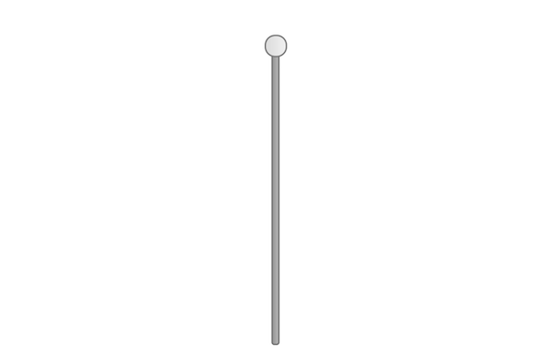

I was preoccupied at that time with my understanding of the game as futuristic, because it's a part of the larger [Speculative Play](http://www.speculativeplay.com/) project I work on with my colleagues [Rilla Khaled](https://rillakhaled.github.io/) and [Chris Moore](http://explore.concordia.ca/christopher-moore). In that project we make playful, interactive experiences that reflect on alternate presents and possible futures, so this game is meant to come from a future where physical sexual intimacy has been 'deprecated' (too icky? too personal?). However, humans still want some sense of giving erotic pleasure to someone else, and so this application exists to provide that service: you give pleasure to a computer (or at least the software running on it). As an application from the future, I immediately jumped toward the idea that it would have a very slick interface, though I did end up making the concession of having some instructional text to avoid total confusion.

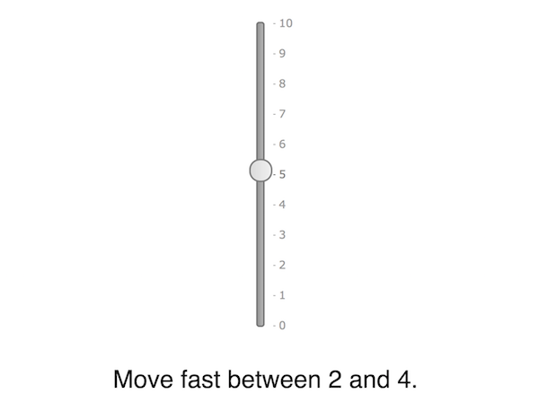

However, in this clean and minimalist iteration of the game, I struggled to do the actual design work necessary to make progress - I was perpetually stuck with the basic idea that you needed to slide the slider's knob across a range of values repeatedly, but couldn't get further with that. Contrary to any ideas that might still float around about aesthetics (visual and other) being secondary to mechanics/rules, this design quandary was very much coming from the visuals of the game. In going with this very clean UI, I was implying qualities of the underlying interactions one would have with it - they would be sophisticated, with that sophistication lying beneath the surface, they would not be funny. The implication of underlying complexity really got me - by having so little UI to guide the experience, I was putting myself in the position of needing to develop subtle methods to communicate the 'pleasure' the UI was receiving, how well the player was performing, and so on. It very much led me into panicky cycles of thinking about how to develop an intricate system that would simulate the underlying arousal of the UI. The implication of seriousness is a huge problem too, of course, given that I generally prefer to make work that is comic.

The 'solution' to these problems wasn't some kind of clever systems-thinking or better writing and better minimalist UI, it was to shift the styling and layout of the interface entirely. To [Windows 3.1/95](https://www.google.ca/search?q=windows+95+dialog+box). Again. Because [I had run into _exactly_ this set of problems before](https://www.pippinbarr.com/2017/05/31/aesthetics-considered-harmful/) when I was developing [_It is as if you were doing work_](https://www.pippinbarr.com/games/2017/07/03/it-is-as-if-you-were-doing-work.html). In that game, too, I started with a slick and futuristic UI only to realise that it was holding me back from the comic element that (I think) good critical design needs. Switching from its minimal UI to the Windows 3.1/95 styling unlocked the personality of the application and allowed me to move ahead with design. So I renamed the sex game from _UI Sex Game_ (working title only of course) to _It is as if you were making love_ at that point, and edited the CSS until it looked more Windows-y.

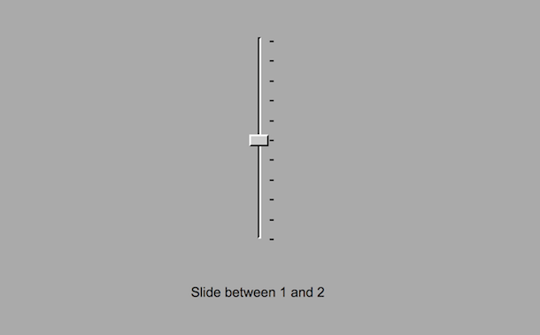

This change is clearly minor in terms of function: in fact it's exactly the same, but it gave _permission_ to think differently about the project and had underlying _implications_ about appropriate design moves. Notably, it made the game a kind of _sequel_ to _It is as if you were doing work_ and therefore put it into a related space of half-serious half-comedy play, a much better fit for a sex game in particular, I think. And in fact the visuals themselves did some design work for me: in this new format, it didn't make sense (to me) to have a slider that moved smoothly and continuously between values. Given the 'pips' marking the Windows-style sliders, I shifted to a slider that 'clicked' between the different values, leading to a ever-so-slightly clumsier experience of using it. Another way to deflate any heightened expectations or claims of idealised sexiness.

Moving forward with this new narrative context implied by the UI visuals, I realised that to fit properly with the _Work_ game and with Windows aesthetics, this game shouldn't be presented as a single-page web-app, but rather should be implied to be an application running on the phone (or PC), so I put the interface elements into a window to capture that idea.

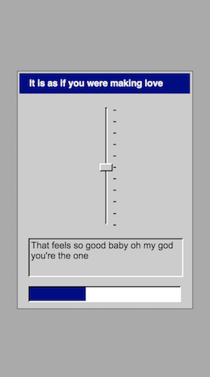

As you can see, the instructional text (placeholder flavour text in that image) is now in one of those non-editable text boxes complete with beveling etc., and I've added a progress bar. Putting the interface into an application window drove those decisions, because it immediately needed to look more 'application-y' that it did with just a slider and plain text. The progress bar, in particular, began to feel like a good direction because the aesthetics were making me ask more and more 'how would 90's Microsoft design the UI and feedback process for this sex game?', my own personal WWJD. This kind of interface feels like it would be much more direct and obvious about registering how the sex is going - it would just tell you. Again, the visuals drove the design.

The game isn't finished yet, but the current UI layout now includes a split between the idea of instructions of how to use the slider (what to set it to) and the output of the system in terms of how it's feeling and any more subtle things it wants (speed of input is going to be a thing). Again, following the lead of the aesthetics, I added labels to the different elements to be even more explicit about what each component is for, while maintaining a kind of neutral 'computer interface language' about it all. (That placeholder text in the 'output' field has to go, for example - language is a big next question for the project.)

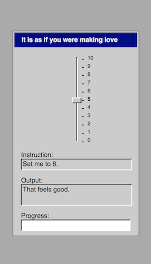

I guess that concludes my little tour through the aesthetic history of _It is as if you were making love_ to date. It's not impossible I'll change everything again, but I doubt it - the change to the Windows visuals just feels right and has opened up a particular framing of the design that I find pleasing, funny, and workable. It's a gift that keeps on giving, too - for instance, in thinking about how to integrate sound into the project, the obvious answer is (again as with _It is as if you were doing work_) to use Microsoft system sounds.

There is joy to be found is asking yourself how to best use the Microsoft 'ding' in a sexy way...

---

# Friday, 8 June 2018, 7:12AM

It's Friday morning and so I'm doing my morning writing. Given that I'll most likely devote the majority of my attention to this game today (aside from a workshop I have to go to), I figure the best writing task for the morning would be to look at where I'm at and figure out where this thing goes.

## Where I'm at

At this point I'd hazard to say that the interface for the game is pretty much all established. We have the startup process by clicking an icon. We have a title card thing (placeholder). We have the basic application UI (windows with slider, input, output, progress, music), and we have the modal text input dialogs (which I just realised I still need to test out on mobile to know whether or not they make any sense).

## When can I see you again?

As I was typing the above I drifted into thinking about the UI element and wondered whether it could be amazing to include a 'when can I see you again?' dialog box where you choose a date and time for a next 'date'? It would remember in a cookie and if you went back it would be there waiting for you. If you went early it wouldn't be there (you could click on the icon and it would tell you to hold your horses). If you went late it would refuse to load until maybe you type in that you were sorry or something?

## And now?

The biggest thing that's missing is some attention to the actual interaction of strokes. The obvious things that need to be changed/done are

- Generally longer periods of time on a single stroke range (though mixing in some shorter is good, probably just a random selection from an array is the easiest way to modulate that)
- Set stroke ranges rather than random (again an array to select) so that we can get more 'suggestive' or erotic ranges like 0 to 10 for example.
- Arousal per stroke rather than per range, fractional and so the notify sound comes when the range changes and not when you're getting progress
- Introducing the breathing/close sound when you're at a specific progress point, maybe a fade in relative to the progress after about 50% or so? Or earlier is probably fine too...
- Having the text input demand actually appear and having a set of phrases/questions (I just thought of 'say my name' which is fun)
  - Tell me that you love me
  - Tell me that you need me
  - Tell me that you want me
  - Say my name
- Maybe also text output dialogs too to emphasise, and you just always click 'Okay'? Ha ha. These could be stronger 'That feels so goods', 'Mmmmmmmmmmms' etc.
  - These could also be used if they don't pay attention to the realtime output about slowing/speeding and thus need to be stopped and told to pay attention (what a confident lover!)
- An ending! (An orgasm!)
  - Breathing sound is loud
  - All the other sounds play randomly or loop
  - Maybe some light flashing of menu bars or the background (not epileptic though)
  - Maybe the slider convulses by setting itself to random values
  - Then it should diminish gradually to a stable state
  - Then a dialog box thanking the player, maybe with a tada
  - And then it all vanishes with the shutdown music back to the desktop
  - (Maybe it asks for another date)
  - If you click the icon again it's too tired/sated to interact with you again, ala Robert's cooldown for Hurt Me Plenty

Yikes. So put that way it's not a tiny amount of work. But it's good work, important work. It at least _feels_ like the above is the stuff that will bring the game across into being genuinely (or at least more) erotic feeling to interact with. The language is a big thing I think, as are the stroke styles and the idea of being attentive to speed. Though I do wonder whether the speed element will somehow end up being too much? But it's needed. Just have to try it and see what happens really.

---

# Tuesday, 12 June 2018, 18:23PM

Okay well, five days later I now have what I suppose is an alpha of the game. It has proper stroke tracking, stroke variations, speed tracking, breathing sounds, text inputs, feedback dialogs, message highlighting, a pretty decent orgasm, and so on. It is as if it were a real videogame made by me.

I'm sitting down to write a few notes on the state of the project here. I think a fair bit of the design thinking behind the various additions is successfully in the commit messages, so I suppose I want to think critically about where it's at right now.

## Language

The big thing that stands out to me at the moment is the tone of the language in the game. Definitely haven't nailed down the right voice or the right relationship between system and player. My writing is kind of trying a bunch of different things to see what sticks. So, for instance, something like "You are very good at this, human lover" feels way off and awkward. It draws too much attention to the falseness of the interaction and is just cringe inducing and unsexy. But something like "I love the way you slide me" feels pretty good I think - it has a vulnerability but maintains the kind of 'neutrality' of interface language/interface verbs. And there are other possibilities in there, including I suppose super neutral interface-only language? Something like "Your use of my slider element is highly successful." But here you pull _all_ the eroticism out and I think it becomes a turn off?

At any rate, the main thing is to try to work out the tone and then rewrite all the pertinent language in the game. It's already in my todos, just wanted to register my feelings about it.

## Orgasm

I really like it! It's pretty well implemented, makes sense to me, and is kind of spectacular. There's a problem, I think, with the pacing of it. I want more of a crescendo followed by a more clearly extended ramp down so that you spend some more time at the bottom of the curve, with just the occasional twitch before it finally finishes. I guess I could hard code a final twitch if I really wanted to. Anyway in terms of signifying the event, it's good.

## Time

When I played it through for Rilla I felt simultaneously like it was too slow and too fast somehow. Like I was boring her, so it should have ended faster, while also it felt like it was over all too soon. The transition from slow to fast felt a little too abrupt, not quite so much time to be playful in there (not that you're allowed to be of course, but still). Not enough time to really dwell in it and sink into the feeling of "I am pleasuring this interface".

## Readme

I think in order to keep with the _Work_ game I do need some kind of diegetic information with the game. I'm thinking a readme.txt on the desktop makes a lot of sense. With a short explanation of the experience in a dialog box. Easy to implement, just need to write the text. That kind of basic worlding is helpful.

## Testing

It's definitely a game that's going to need fairly serious testing to get it just right. It's so reliant on the player's emotional reaction and to them playing along, so trying to make sure that's possible and feels rewarded is going to be really important.

## Cooldowns and dates

Did think seriously about both having a cooldown before you could play again and having the option of setting up a 'date' with the interface when you would come back. I like both those ideas in general, I think they're fun and interesting (and sometimes important) ways to present interaction, but I think in this case it pulls me away from the speculative play line I've been developing for the game. If the game is software created by computers to simulate an erotic experience for the benefit of a human user, then it doesn't make sense to have the cooldown idea because it prevents the human user from perhaps repeating the experience immediately if they find it gratifying. The computer doesn't _need_ a cooldown, obviously - it's a computer, it's software. So it becomes too artificial and isn't really serving a purpose in this context.

Pleasingly, the software is designed as 'software to please a human' but in the form of 'software to be pleased by a human'. Fun trick.

## Here we are then

Overall, this is a pretty solid version of what I'd envisaged I think. It's clearly very different to my original approach with the vibrating pulsing contemporary-looking slider, but I think it's doing what I wanted it to do. I think it _is_ a bit sexy or erotic to bring the interface all the way to orgasm.

---

# Friday, 15 June 2018, 7:17AM

This morning I wanted to spend some time writing about the problem of verticality in the game, maybe as something to post more publicly, maybe not, but I guess I'll try to write it in a voice that's more public.

...

## Penis problems: Designing the erotic user-interface of It is as if you were making love

My user-interface sex game _It is as if you were making love_ has reached a point where I've been able to actually show it to other people and ask them what they think. It has a opening sequence (starting the software from a faux desktop, looking at the splash screen), a core gameplay loop (moving the slider according to instructions), and a closing sequence (computational orgasm, shutdown). It all works and does, essentially, what I'd envisaged from pretty much the beginning of the project.

The basic concept behind the game revolves around a near-ish future in which people no longer want to engage in physical intimacy with other people and, in fact, are creeped out by even having sex with other humans via technical intermediaries. Because people still value the experience of giving erotic pleasure, however, this software (_It is as if you were making love_) has been developed to provide an outlet: it is software that allows you to simulate giving pleasure to someone (or something).

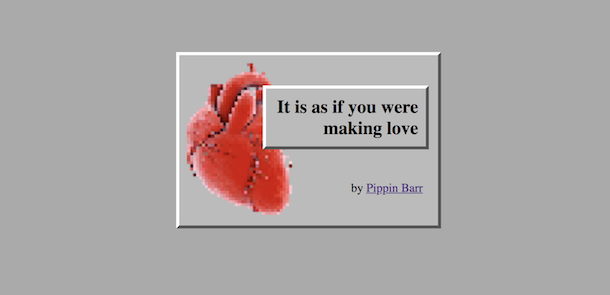

Showing a game to other people, however, pulls you out of your tunnel vision of what you're making and forces you to acknowledge that your work can have meanings and affects that don't fit in with how you experience it. As such, when I showed the game to my parents, I was pushed into really reencountering my own game to a large extent. (My parents are almost always my first testing group for every game I've made - they're an excellent combination of computer literature, non-game-literate, and connoisseurs of contemporary art.)

After they played, I got very helpful usability points from them both (particularly around the dexterity involved in moving the slider quickly), but most importantly I got my mother's understanding of the game as a woman. And specifically, she reported that from her perspective that game felt like being in service to a male, rather than my goal of the game feeling like giving pleasure to a more ambiguous entity.

It was important to hear this, because somewhere in my heart I knew this was going to be an issue with the game: one of the main starting points for _It is as if you were making love_ is the (very NSFW) flash game [_Sepe's Cumshot_](https://www.comdotgame.com/play/sepes-cumshot). The awkward erotic charge I feel when playing that game is a big part of what I wanted to chase with my game, but with classic user-interface elements instead of a 3D muscleman. But of course a game with that kind of providence is going to be pretty oriented toward a specific understanding of pleasure, bodies and "sexual input".

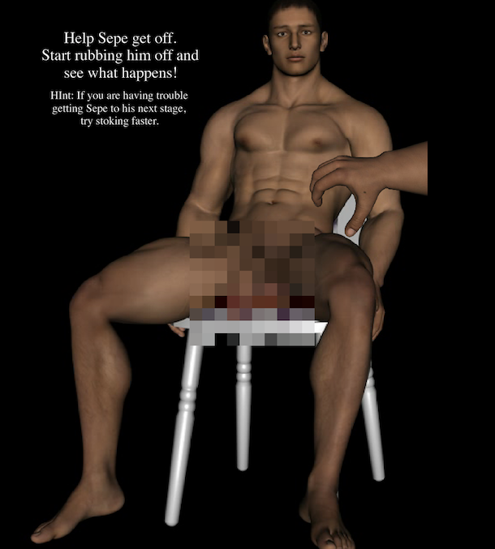

It stings especially because it's exactly the same problem I ended up having with [_Hot Coffee_](http://www.pippinbarr.com/2012/05/04/hot-coffee/) (a sex game using the metaphor of coffee-making): it's what I guess I would characterise as a male sexuality, reflecting the game it satirised (the [Hot Coffee Mod](https://en.wikipedia.org/wiki/Hot_Coffee_mod) of [Grand Theft Auto: San Andreas](http://www.rockstargames.com/sanandreas/)). But, while I allowed myself to just feel a bit guilty with _Hot Coffee_, for this new game I really don't want to let this cis-gender-male-dominant angle stand, so I need to work on it.

There are two key areas that I see as being integral to detuning this issue in _It is as if you were making love_: the slider itself and the framing of the player's roleplaying.

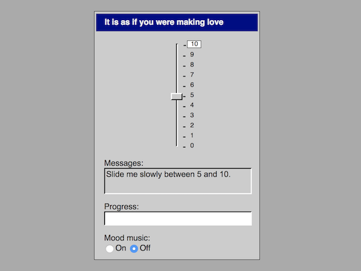

First of all, the slider is pretty darn penis-y in the configuration I've got here: it's a vertical (erect) element and you interact with it by sliding the handle/knob up and down repeatedly. A key reason I went with the slider is that it's the key classical user-interface element that allows for continuous, real-time interaction. A scroll bar does this too, of course, but a scroll bar is just a kind of slider. Other user-interface elements tend to be discrete on/off kinds of interactions, from checkboxes to radio buttons to drop-down menus. I feel like continuous, real-time motion is kind of central to the idea of making the interaction erotic, it's more analog and serves as a better analog to the kinds of motions we often make in sex.

So I feel like I'm 'stuck' with the slider in terms of the input it enables, and because it's one of only a small set of classical elements possible (both in terms of what [jQuery UI](http://jqueryui.com/) offers me, and in terms of what figures in most people's understanding of what counts as a 'typical' interface). As such, I need to detune the slider itself. My current design move is two-fold. First, I'm rotating the slider to be horizontal so that it's less immediately reminiscent of an erect penis. It's surprising to me how much this helps when I try the horizontal prototype, perhaps also in part because horizontal sliders might be more common in user-interface and thus read more immediately as "just typical UI" rather than being atypical enough to immediately suggest other readings.

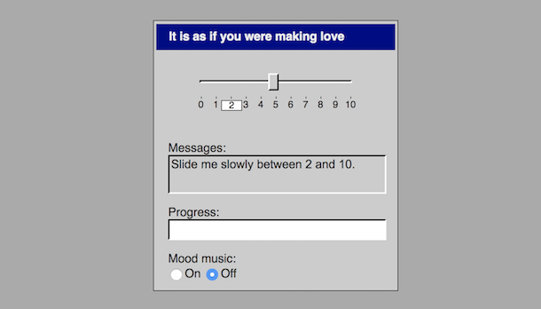

The second 'fix' is to alter the numbering on the slider. The vertical slider was numbered from 0 to 10, with 0 at the bottom and 10 at the top. That means the slider has not only an axis, but also a kind of _direction_ - it has a 'base' and a 'tip' that make it all the more suggestive of a penis. By shifting the labels to run from -5 (far left) to 0 (centre) to 5 (far right), the horizontal slider is implied to be symmetrical rather that pointing in a specific direction, properties that are perhaps a better fit with a vagina (see also: [Luxuria Superbia](http://luxuria-superbia.com/)), or at least a more ambiguous sensual input. (Believe me, I never thought I would be doing close readings of classical user-interface elements as genitalia/erogenous zones, but here we are.) So the hope here is not that slider becomes 'more of a vagina than a penis' but rather that it evokes genitalia/intimate body parts in a way that isn't heavily aligned with a specific corresponding human anatomy.

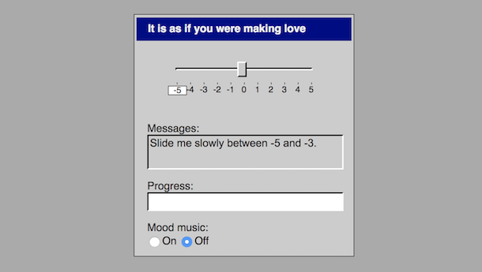

The other big challenge ahead, which I've done much less to actually deal with as yet, is to think about how the game frames the player's relationship to play. As above, my vision is that the game exists in a speculative future - as such the real player (in our present reality) roleplays as a person from that speculative future. Further, the game presents as software that is meant to have been created to allow people to experience the erotic charge of giving sexual pleasure without involving other humans. As such, the real play (in our present reality) roleplays as a person who has that in mind (or at least is interested in that experience). Conveying all this is very difficult and is hugely the work of the 'about' text I include as an option at the beginning of the game.

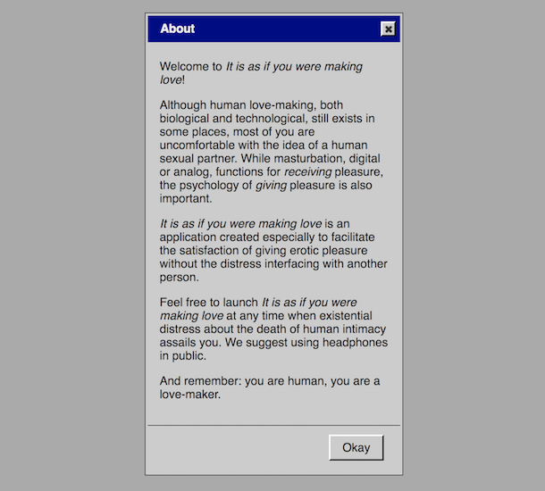

My first 'solid' draft of this text focuses heavily on using the same tone as the text for [_It is as if you were doing work_](https://github.com/pippinbarr/itisasifyouweredoingwork/), which makes sense, but which has, I think, led it to be a combination neutrality and irony about the state of the speculative future the game comes from. In the context of 'making love', though, or at least of erotic pleasure, that kind of tone probably ends up reading as vaguely hostile and definitely as a buzz-kill. So there's a need to find a voice for that text that both communicates the speculative proposition of the game, but doesn't immediately set the player in a vaguely combative or bleak relationship to the interface. (And, after all, the fictional writers of the about text _wouldn't want that_ anyway - it's one thing to try to evoke a level of cynical 'robot emotional intelligence', as I think of the text as being written by AIs, but it can go too far.)

Beyond the introductory text, there's a bunch of language in the game itself that the interface uses to express its erotic pleasure in reaction to the player's interactions. Right now it's pretty much placeholder 'sex talk' like 'mmmmmm' and 'that's feels good', etc., so there's work to be done there too. Of course, I want the voice to not read as male here too, which shouldn't be too difficult I hope, but more importantly it needs to continue the invitation to an erotic experience throughout, needs to help keep that alive. I suspect that the most obvious kind of text, which I have now, isn't going to cut it for that either. At present I don't really have a strong direction for this text beyond figuring I'll rewrite it and see what happens.

So, that's the state of affairs right now with _It is as if you were making love_ and its "penis problem". Ultimately, I think it's a fascinating problem to have, to get down to the level of _specific interface elements_ and specific _rotations_ of interface elements in talking about erotic interaction. It really pushes my buttons.

---

# Monday, 18 June 2018, 7:42AM

I'm writing an entry during my writing hour just to say a thing or two in continuation of the above discussion of the penis problem.

I've written before about how the penis-esque nature of the cumulatively-labelled vertical slider causes a conflict for me in terms of trying to make _It is as if you were making love_ non-gendered. My aim was to find a way to alter the slider away from being a user-interface penis and toward being a more ambiguous erotic input. All that said, I want to acknowledge a worry around detuning the penis-slider. A couple of days ago I happened to end up showing the game to an undergraduate software engineering class I was guest lecturing. I discussed the ideas around transforming my vertical slider in response to feedback (chiefly from my mother, as I've said) and I told the story chronologically, so the first thing I showed was the vertical version of the slider.

As I interacted with the slider to demonstrate the game it got a big and deeply gratifying laugh. That laugh returned me to a key goal I have with _It is as if you were making love_ and have, frankly, with most of my work: comedy. With the exception of a couple of games (e.g. [_A Series of Gunshots_](http://www.pippinbarr.com/2015/11/19/a-series-of-gunshots/)), I  like to treat my subject matter with humour in no small part because it's more entertaining for me to make games that way, and because I think it can make the underlying ideas more accessible to people. The horizontal slider, though admittedly appearing second and so losing the element of surprise, didn't generate as much hilarity and later that evening it occurred to me to worry about this:

_Are taking a 'progressive' position on sex, sexuality, gender, etc. in some way incompatible in this context with making a game that tackles its subject matter with a sense of humour?_

Or, put another way, was the humour of this game reliant on a dick joke?

In the end, I don't think it is. Although there's a definite comic element to penises in general and the idea of a user-interface penis specifically, my feeling is that _It is as if you were making love_ has always been intended to play on a 'higher-level' joke about sex and computers. Specifically, from the very beginning, the thing that struck me as interesting about using [Sepe's Cumshot](https://www.comdotgame.com/play/sepes-cumshot) (porn game hosted on hosted on a porn site, so very NSFW) as a starting point was the idea of trying to recreate the weird _eroticism_ (for me) of that game using only standard user-interface elements. That is, could standard user-interface elements (like a slider, but also like buttons, dialog boxes, etc.) be presented in such a way as to have a sexual charge?

Actually working on the game, however, it's been easy to get lost amongst the different layers of its narrative frames. It is, after all, 1) a game you play in your browser as a regular old human being in 2018,  which 2) pretends to be a game from the future designed to aid humans in satisfying a desire to give erotic pleasure that 3) implements this by pretending to be an interface that genuinely receives pleasure from human input.

Level 2 is where I think the actual humour of the game resides: the absurdity of having a designed erotic experience with a classic-looking user interface. However, I of course want this to be in tension with an _actual erotic experience_ at the same time - that's what I see as the magic trick the game needs to pull off. It needs to be both funny that one should have a game that tries to create a 'sexy' interaction with your computer, but then also it needs to be surprising that the interaction turns out to really be sexy (to some degree).

However, I've been getting stuck on Level 3 at times, I think, and thus becoming concerned that the game _can't_ be funny. At that level of a kind of second-order fiction of a computer _really receiving erotic pleasure_, I find myself anxious about my representation of that, not just in terms of gender, but the broader question of what my responsibilities are, what I'm saying about pleasure, who I might be excluding, attitudes I might be promoting, simplifications I might be making, etc.

But the game isn't really _about_ level 3, it's about level 2 for me - level 3 is 'just' an extra fictional level required and implemented by the fictional game designers at level 2 to aid in the eroticism of the experience. As such, the game itself does _not really receive erotic pleasure_ (this should probably be obvious? Is it obvious?), negating (I think) a number of the concerns that level 3 can raise. At level 2 we can, I believe, enjoy the humourous tension between erotic charge and decidedly non-erotic Windows 95 interface elements quite successfully.

All that said, I think this diversion illustrates that there's clearly room for a much expanded and differently focused approach to some of the questions this game design raises. What if we tried to make another game out of classical user-interface elements that really _did_ try to address more complex and rich representations of sexuality and erotic pleasure? What interface elements would we use? What would the computer say? How would the underlying system represent and track arousal and other qualities of the interaction? What is erotic for a computer anyway? It's a whole other giant project, in other words!

For the moment, however, I'll stick with my it's-not-a-dick-joke joke game.
